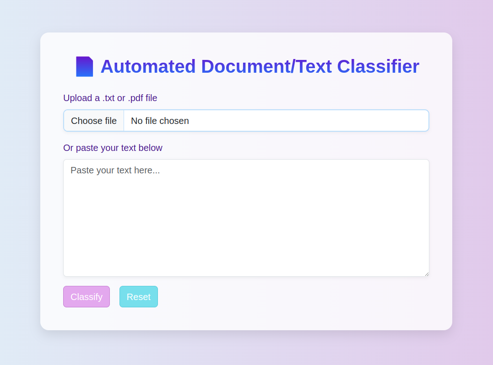

# Document Classifier Web App

Classifies any given text into one of 20 topics using Machine Learning.
(**Linear Support Vector Classification (LinearSVC)** + **TF-IDF** vectorization).  
Web app built using Flask.

---

## Dataset Used
- **20 Newsgroups Dataset** (sklearn.datasets)
- Preprocessed using TF-IDF vectorizer (bigrams, min_df=5, max_df=0.9)

---

## (Colab Notebook)
[Open in Google Colab](https://colab.research.google.com/drive/1tdcbA3ml0W9nK6d1BoFz43JQPAOxat3k#scrollTo=gwVN1QM6pa9P)

---

## How to Run Locally

### 1. Clone the repository 
    git clone https://github.com/med-08/Document-Text-Classifier.git
      
### 2. Install requirements
    pip install -r requirements.txt

### 3. Run the app
    python3 app.py

## Website looks like:

## Features
- Text classification into 20 categories
- Clean web interface with Flask
- Auto vectorization + model prediction

